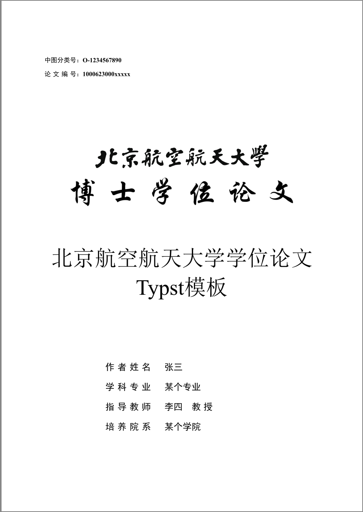

# BUAA-Typst

Typst template for dissertations in Beihang University (BUAA).

Forked from [PKUTHSS-Typst](https://github.com/lucifer1004/pkuthss-typst)

The full PDF file is available [here](./build/thesis.pdf)

## Usage

- Install the latest version of [Typst](https://github.com/typst/typst)
- Download and extract the entire folder
- Modify `thesis.typ`
- Run `typst --font-path fonts compile thesis.typ` to compile the thesis

## Notice
- 如使用v0.9之前的版本，使用 GB/T7714 引文格式请参考 [typstcite.md](./typstcite.md)
- 对应的改动的exe为typstGBT.exe
- v0.9已经支持CSL，如果需要可以自行下载新版typst