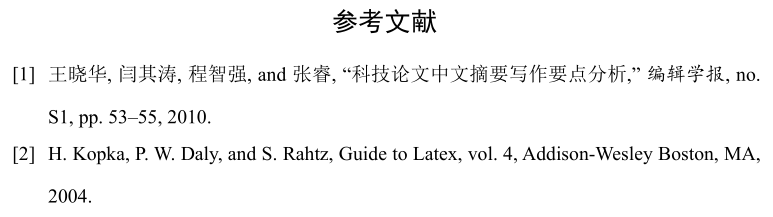
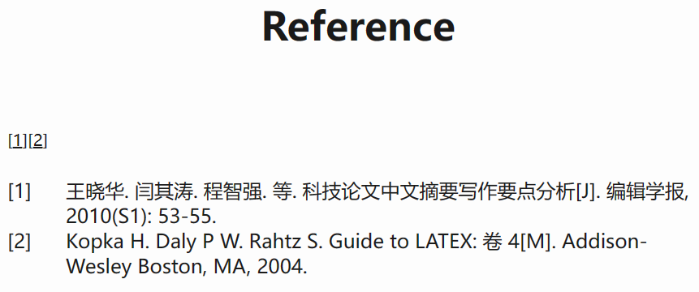
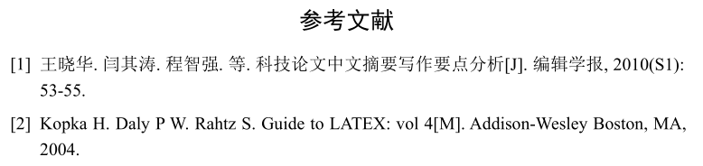

# 让typst曲线支持引用国标GB/T7714

typst能高速编译，增量更新，语法友好，相对latex简直是科研福音。但目前支持的引用类型实在太少，目前只有4种格式(apa, chicago, ieee, mla)，缺乏一个像natbib一样好使的引用包。但在写中文论文或学位论文时，需要使用国标格式(GB/T7714)，typst没有内建的方式来实现。

不过没关系，[Citation Style Language (CSL)](https://citationstyles.org/) 为我们提供了一种专门用于引用的描述语言，只要选择对应格式的csl文件，用citeproc包就可以处理csl，来实现任意格式的引文。但目前的citeproc-rs年久失修，而且typst使用的引用管理器Hayagriva巨复杂，在实现上对上述4种引用格式分别实现了一个上千行的rs文件，属于是重复造轮子，在设计之初就没想明白了。

所以想要typst使用国标，只能是曲线救国。也就是说需要手动整一下。为了假装可以全自动操作，我们得想办法让typst输出参考文献各个entry的最终顺序，然后把entry转变为格式化的引用，再把输出放到typst的源文件里面就好了。虽然需要再编译一次，但这样其实也无妨，谁让咱typst编译快呢。这样一来，就能初步实现想要的效果了。

思路有了，下面来一步步操作。

## 第一步

修改typst的源码，让他在生成参考文献列表时输出一下引用的bib文件里中的entry。

在源码里一顿找，注意到，在[这一行](https://github.com/typst/typst/blob/b6a241cad232d920154986781c6f09d83dc1b6f6/library/src/meta/bibliography.rs#L175)把reference写入了文档。那顺着找到works的构造函数，发现在[这一行](https://github.com/typst/typst/blob/b6a241cad232d920154986781c6f09d83dc1b6f6/library/src/meta/bibliography.rs#L554)构建了reference，于是在map中将其引用的key输出即可。

```rust
    .map(|reference| {
        {   // print the bibliography keys
            let key = reference.entry.key();
            println!("@{}", &key);
        }
        ...
    }
```

把修改完的typst复制到项目目录。现在每次编译时都会输出reference对应的keys列表，效果如下：

```powershell
PS F:\codes\typst> .\typst.exe compile .\thesis.typ  
@wang2010guide
@kopka2004guide
```

typst自带的引用格式如图所示：



## 第二步

使用pandoc把得到的entry list ，根据csl的格式定义，以及现有的bib数据库转为格式化的引用。

直接使用citeproc不甚友好，但调用pandoc可以很轻松的实现。
把typst的输出写入到文件ref.md，然后使用pandoc：

```powershell
(base) PS F:\codes\typst> pandoc --citeproc ref.md --bibliography .\ref.bib --csl .\chinese-gb7714-2005-numeric.csl -o ref.html
```

输出是一个html，在文件可以预览一下:



写一个简单的脚本把引用文本提取出来：

```python
import bs4,re
res = open('ref.html','r').read()
soup = bs4.BeautifulSoup(res,features="html.parser")
refs = soup.find_all('div','csl-right-inline')
reflist = []
for idx,ref in enumerate(refs):
    content = re.sub('\n','',ref.text)
    print(f'[{idx+1}] {content}')
    reflist.append(content)
```

即可得到格式化的引用：

> [1] 王晓华. 闫其涛. 程智强. 等. 科技论文中文摘要写作要点分析[J]. 编辑学报, 2010(S1): 53-55.\
[2] Kopka H. Daly P W. Rahtz S. Guide to LATEX: 卷 4[M]. Addison-Wesley Boston, MA, 2004.

可以看到，这里在英文引文中出现了“卷”，同样地，要是作者超过三人，还会出现“等”。故还需要根据引文的语言，进行中英文替换，得到正确的引文:

>[1] 王晓华. 闫其涛. 程智强. 等. 科技论文中文摘要写作要点分析[J]. 编辑学报, 2010(S1): 53-55.\
[2] Kopka H. Daly P W. Rahtz S. Guide to LATEX: vol 4[M]. Addison-Wesley Boston, MA, 2004.


## 第三步

把引用写入typst文件

```python
typoutfile = "ref.typ"
with open(typoutfile,'w') as f:
    for ref in reflist:
        f.write(f'+ {ref}\n\n')
```

在typst文件末尾添加

```typst
#set(enum,numbering:"[1]")
#heading("Reference",numbering: none)
#include "ref.typ"
```

还需要把原来的bibliography给隐藏一下

```typst
#[
#set text(size: 0pt) 
#bibliography("ref.bib")
]
```

再编译一次就ok了，看看效果：



把以上的步骤写到一个脚本里面，写好文件的路径，即可用typst自动实现GB/T7714的引文格式了。

由于用了pandoc，结果可以输出到word，html以及任何pandoc支持的格式，可以直接复制到其他的工具中。虽然pandoc最新版(3.1.2)已经支持 typst 的 writer 了，但目前的这个输出也无法编译(pandoc几乎就是逐字翻译的，很多时候都无法编译)，比较废柴。

这个方案的缺点也很明显，目前的引用都是link到原来bib的label上，但将原来的bib隐藏后，在pdf中就无法正确跳转了。要从外边解决这个问题就需要自己写一遍引用，暂时就不折腾了，等typst支持CSL了也就没有必要了。

<!-- 文中所用到的脚本及相关资源见 github repo [北航学位论文typst模板](https://github.com/cherichy/BUAA-typst)，欢迎三连。 -->